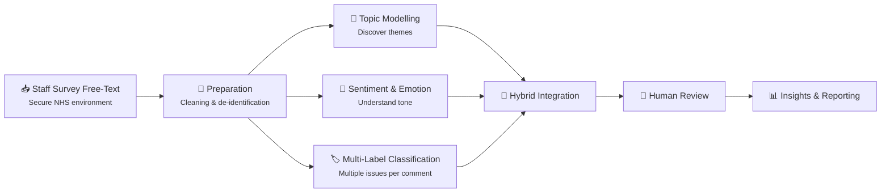

# Y3_EPA_NHS-Staff-Survey_NLP-Hybrid-Workflow

## Overview
This project explores how NLP can be used to analyse free‑text comments in the NHS Staff Survey.  
The aim is to identify themes, emotions, and patterns in staff experience while maintaining transparency, ethics, and usefulness for organisational decision‑making.

The workflow combines several modern techniques including topic modelling, sentiment analysis, multi‑label classification, and transformer‑based language models.  
It is designed to be clear, reproducible, and suitable for use within NHS IG requirements.

## High‑Level Workflow Overview

## What this project does
Helps organisations to:
- Understand what staff are talking about in their free comments
- Identify common themes such as: workload, leadership, teamwork, wellbeing
- Detect emotional tone: frustration, pride, anxiety, optimism
- Recognise when comments relate to more than one issue at the same time
- Produce insights that support workforce planning, culture improvement, and staff wellbeing initiatives
**No real NHS data is included in this repository.**
Only example structures and placeholder files are provided

## Why this  matters
Free text contains rich insights that quant often miss. However, manually reading is time-concuming, inconsistent, and emotionally taxxing

NLP offers a way to ana,yse at scale while still respecting:

- Staff confidentiality
- NHS IG
- Ethical and fair use of AI
- Transparency and accountability

Project demonstrates how these principles can be combined - practical, responsible workflow

## How it works
4 main stages
#### Preparation
- Text is cleaned and prepared
- No personal identifiers used
- Data handled with NHS IG standards
  
#### Understanding the Content
- Topic modelling for main themes
- Multi-label classification for comments that relate to several issues at once
  
#### Understanding the Emotion
- Sentiment and emotion analysis for tone
- Helps identify areas of concern or positive experience
  
#### Bringing it Together
- Hybrid pipeline combines methods
- Results summarised in a clear, accessible way
- Human review included to ensure accuracy and fairness

## What's Inside
Repo organised into simple folders

- docs/ - Plain English explanations of workflow, ethics, and evaluation
- notebooks/ - Step by step example analysis notebooks
- src/ - Code used to run the workflow
- reports/ - Example outputs and diagrams
- data/ - empty folders showing where data WOULD go

## IG and ethics summary
Project follows key principle

- No identifiable data stored in repo
- All analysis steps are transparent and documented
- Human oversight included to avoid misinterpretation
- Methods chosen to minimuse bias and support fairness
- Workflow aligns with GDPR and NHS IG expectations

Full explaination available in docs/ethics_ig.md

# Dataset Selection and Rationale (2020 - 2025)

Understanding which datasets are suitable for model fine-tuning is a critical part of building a responsible NLP workflow.
This project includes an automated scoring framework that evaluates each dataset across **coverage**, **quality**, and **relevance**, supported by domain knowledge about how NHS Staff Survey behaviour has changed over time.

## Behavioural shift in NHS Staff Survey free-text

### **2020 - COVID-specific anomaly**
- Very high response volume
- Long, emotionally expressive comments
- High thematic richness
- Elevated IG-risk
- Driven by a highly salient COVID-related prompt

Although 2020 scores highly under mechanical metrics, it does **not** represent typical staff survey behaviour.
Using it for fine-tuning would bias the model toward crisis-era sentiment and distort expectations of comment length and emotional tone.

### **2021-2025 - the "new normal"**
- Response volumes stabilise around 450 - 600 comments per year
- Comments are shorter and more generalised
- The free-text question was broadened, reducing emotional salience
- High data quality but low relevance for fine-tuning
- Reflects genuine behavioural change, not a data quality issue

These datasets are valuable for **evaluation**, but individually too small and too shallow for fine-tuning

## Contextual Override
To ensure the model is trained responsibly, a contextual override is applied

- **2020 is excluded** from fine-tuning due to being a COVID-specific anomaly
- **2021-2025 are excluded** from fine-tuning due to insufficient relevance and volume
- **The combined multi-year dataset** is used for fine-tuning as it best represents the post-COVID "new normal"

This approach balances
- Statistical scoring
- Domain knowledge
- IG considerations
- Model fairness and generalisability

## Who it's for
- NHS workforce teams
- Organisational development and culture teams
- Analysts and data scientists
- Leaders seeking evidence-based insight
- Apprentices and students completing applied project

Wrriten to be accessible for both tech and non tech audiences

## How to use
- documentation to understand workflow
- notebooks to see example analyses
- code to understand how each method works
- reports to view example outputs

You do **NOT** need tech skills to understand the high-level concepts

## Contact details
For questions, improvements, or collaboration, please contact the project owner
